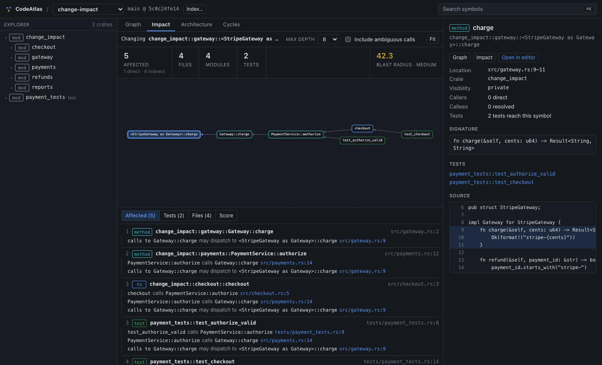
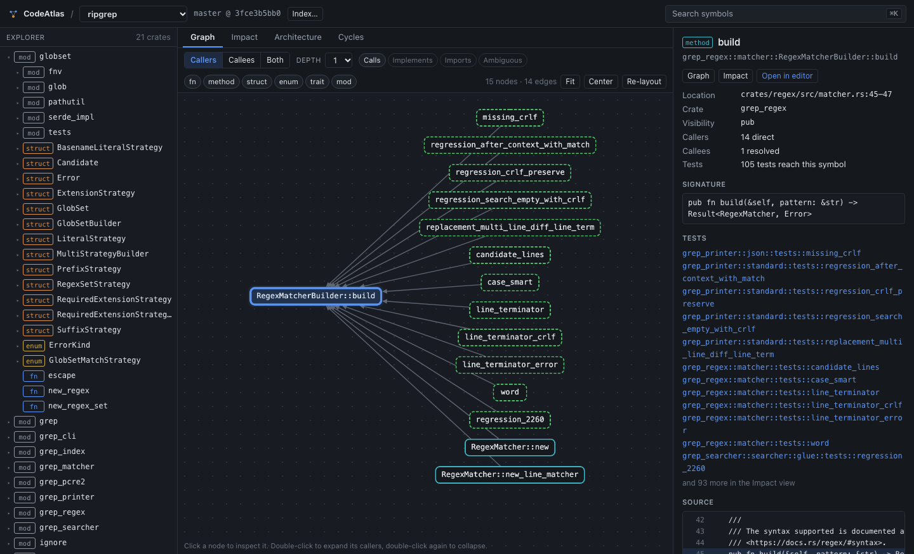
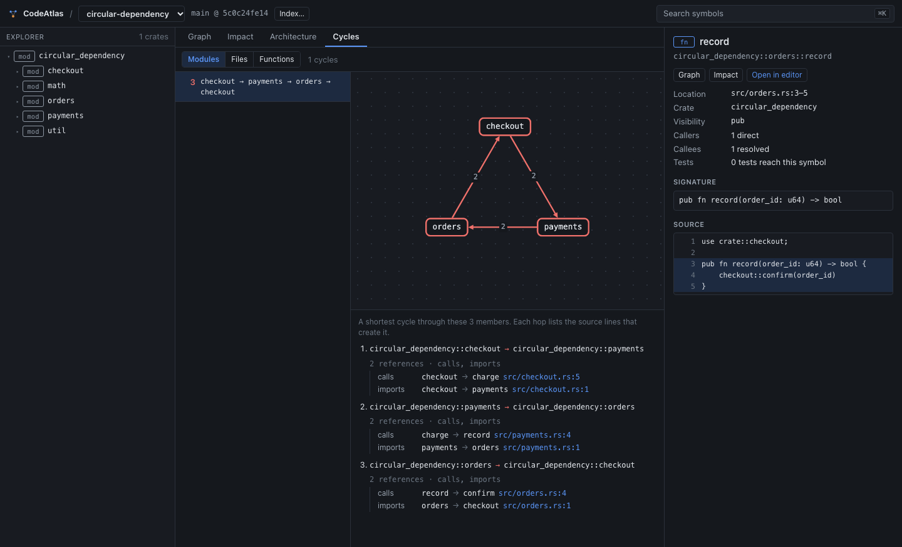
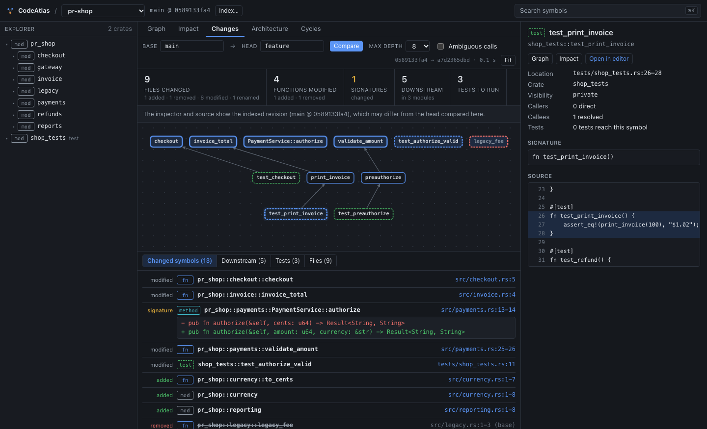
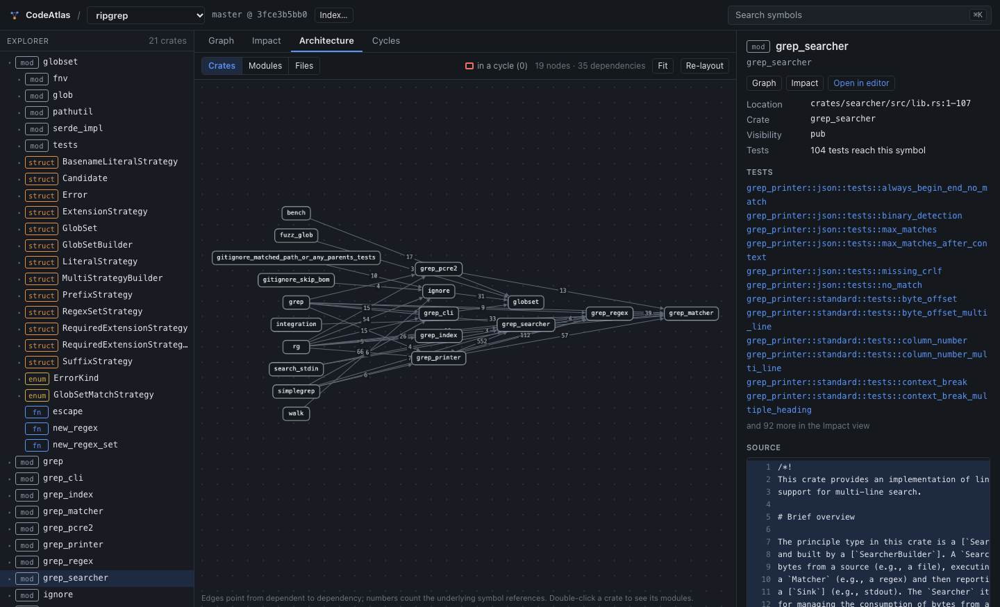

# CodeAtlas

CodeAtlas analyses a Git repository, turns its source code into a dependency
graph, and answers change-impact questions: *if I change this function,
type, module or file, what else could be affected, and why?*

Answers come from static analysis and graph traversal, not from a language
model guessing about the code. Every conclusion is meant to be traceable to
source locations.

> **Status: Milestone 9 of 11.** Ingestion, Rust module-tree
> construction, tree-sitter parsing, symbol extraction, symbol resolution
> (with measured quality), the Neo4j code graph with incremental indexing,
> bounded graph queries, graph algorithms, the change-impact engine, test
> selection (with measured precision and recall), Git diff impact, the
> GraphQL API and the web workspace are implemented and tested. A
> benchmark suite and optional local-model explanations remain. See
> [docs/architecture.md](docs/architecture.md#milestones).

## Why static analysis

Impact analysis is only useful if it can be trusted and explained. A parser
sees exactly what is written; a symbol table decides what each name refers
to, or reports that it cannot. A graph traversal over those facts produces
a result that can be reproduced and justified edge by edge. Rust is the first
supported language because its module system and explicit `use` paths allow
a high share of references to be resolved without full type inference.

## Architecture

```
ingest → module tree → tree-sitter parse → extract → resolve → Neo4j + queries → algorithms / impact → GraphQL → SvelteKit
└──────────────────────────────────────────────────── implemented ───────────────────────────────────────────────────────┘
```

* `crates/analyzer`: the analysis core, a pure library with no database code.
* `crates/store`: Neo4j persistence and bounded graph queries.
* `crates/server`: the GraphQL API (`codeatlas-server`).
* `crates/cli`: the `codeatlas` command.
* `web/`: the workspace UI (SvelteKit, TypeScript, Cytoscape.js), a static
  single-page app that talks only to the GraphQL API.
* `fixtures/`: small Rust repositories with hand-written ground truth
  (`expected.json`).
* `docs/`: [architecture](docs/architecture.md),
  [graph model](docs/graph-model.md),
  [symbol resolution](docs/symbol-resolution.md),
  [change impact and graph algorithms](docs/impact-analysis.md) and the
  [GraphQL API](docs/api.md) with its [schema](docs/schema.graphql).

## What it does today

**Extraction.** For each Rust file: modules, structs, enums, traits,
functions, methods (inherent, trait-impl, trait default and required),
tests (`#[test]`, `#[tokio::test]`, …), `#[cfg(test)]` scopes, imports
(including `extern crate … as …`), type aliases, impl blocks, local
bindings, struct field types and every call site with its enclosing caller.
Calls inside `assert!`-style macros are recovered by re-parsing macro
arguments. Each symbol has a stable ID
(`method:shop::payments::PaymentService::authorize`), kind, name, qualified
name, file, line span, parent, visibility and signature.

**Module tree.** Files are placed in crates and modules by following `mod`
declarations from each crate root, including `#[path]`, as the compiler
does.

**Resolution.** Every call site is classified as *resolved* (one
definition, becomes a `CALLS` edge), *ambiguous* (candidates and a reason
are kept), *unresolved* (with a reason), *external*, *constructor* or
*local*. Paths are resolved with Rust's scoping and visibility rules;
method calls through the receiver's type where it can be determined from
parameters, fields, constructor calls, `?` and builder chains. Nothing is
matched by name similarity. Details:
[docs/symbol-resolution.md](docs/symbol-resolution.md).

**Code graph.** Repositories are stored in Neo4j as symbols, files and
crates connected by `CALLS`, `IMPORTS`, `IMPLEMENTS`, `CONTAINS`,
`DEFINES`, `DEPENDS_ON` (derived file and module dependencies) and
`CALLS_CANDIDATE` (ambiguous calls, kept apart from resolved ones).
Queries answer *who calls this*, *what does this call*, *what depends on
this transitively*, *which tests reach this*, *how are A and B connected*
and *which files or modules depend on this*. Every query has depth and size
limits, and every result carries the edges and source lines that justify
it. Schema and queries: [docs/graph-model.md](docs/graph-model.md).

**Change impact.** Given a changed function, method, type, module or file,
CodeAtlas lists every symbol that could be affected, with depth, the
affected files, modules and tests, and for each one the chain of facts
connecting it to the change: *`test_checkout` calls `checkout` (line 16),
which calls `authorize` (line 5), which calls `validate_amount` (line 13)*.
Impact follows resolved calls and trait dispatch. Ambiguous calls are
followed only on request and reported as *possible*. A blast-radius score
summarises the reach and is broken down into its six factors; it measures
reach, not the likelihood of breakage. Details:
[docs/impact-analysis.md](docs/impact-analysis.md).

**Architecture.** Circular dependencies (Tarjan SCC) at module, file and
function level, each with a shortest cycle and the source lines of every
hop; hotspots by betweenness centrality and fan-in/fan-out; and dependency
layers with cycles collapsed.

**Test selection.** For changed symbols, CodeAtlas lists the tests to
run: *direct* tests that call the changed code, *transitive* tests that
reach it through other code, *possible* ones reached only through
ambiguous calls, and changed code that no test reaches, each test with
the chain of calls that connects it to the change. How well this works is
measured, not assumed: `probe-tests` makes functions panic one at a time,
runs the real test suite and records which tests fail; `evaluate-tests`
compares that with the selection (see
[Test-impact quality](#test-impact-quality)).

**Incremental indexing.** Re-indexing a repository parses only the files
whose content changed (or whose module path did), re-resolves references
across the whole repository in memory, and writes only the nodes and
relationships that differ from the stored graph, in one transaction. The
result is the graph a full index would produce; the tests compare the two
property by property, on the fixtures and on ripgrep. Details:
[docs/architecture.md](docs/architecture.md#incremental-indexing).

**Git diff impact.** Given two revisions (branches, tags, commits, or a
commit and the uncommitted working tree), CodeAtlas lists the changed
files and, symbol by symbol, what was added, removed, modified or moved,
with the changed lines and any signature change. Formatting-only and
comment-only edits are recognised and kept apart. The modified and removed
symbols then go through the impact engine: the report lists every
unchanged symbol that depends on the change, with its evidence chain, and
the tests to run. Output as text, Markdown for a pull-request comment, or
JSON. Details: [docs/impact-analysis.md](docs/impact-analysis.md#git-diff-impact).

**Workspace UI.** A browser workspace over the API: an explorer of crates,
modules and their symbols on the left, a graph in the centre and an
inspector on the right. Symbols are found with a command palette (`⌘K` /
`Ctrl+K`). The centre has five views:

* *Graph*: callers, callees or both of a symbol, to a chosen depth and
  over chosen relations. Double-click expands a node; double-click again
  collapses it.
* *Impact*: the change-impact report, with the affected graph and the
  evidence chain of every affected symbol.
* *Changes*: the Git diff impact report for two revisions chosen from
  the repository's branches, tags and commits.
* *Architecture*: dependencies between crates, zooming into modules or
  files.
* *Cycles*: circular dependencies at module, file or function level.

Every edge in a list links to the source line behind it, and the inspector
shows the symbol's source with that line highlighted. Selections are kept
in the URL, so a view can be shared or bookmarked.

## Screenshots

Impact of changing `<StripeGateway as Gateway>::charge` in the
`change-impact` fixture. Trait dispatch is shown as its own step, and each
affected symbol lists the source lines connecting it to the change.



Callers of `RegexMatcherBuilder::build` in ripgrep (tests dashed):



A module cycle in the `circular-dependency` fixture, with the calls and
imports behind each hop:



Impact of a branch (the `pr-impact` fixture, `main` → `feature`): changed
symbols with the signature change, the graph from changed symbols (top
row; the removed one dashed red) to the unchanged code and tests that
depend on them:



Crate dependencies in ripgrep. Edge numbers count the symbol references
behind each dependency.



Screenshots are from a local run; the status bar, which shows the
repository's path on disk, is cropped.

## Installation

Requirements: Rust 1.80+ (`rustup` recommended), `git` on `PATH`, Docker
for the graph database (`analyze` and `evaluate` work without it), and
Node.js 22.17+ for the web UI.

```bash
git clone <this repository> codeatlas
```

```bash
cd codeatlas && cargo build --release
```

Start Neo4j. Copy `.env.example` to `.env` and set
`CODEATLAS_NEO4J_PASSWORD` (at least 8 characters) first:

```bash
cp .env.example .env
```

```bash
docker compose up -d
```

`docker-compose.yml` runs `neo4j:5.26-community` with the password from
`.env`, a named data volume, and the browser UI on
<http://localhost:7474>.

## Usage

Analyse a local repository:

```bash
./target/release/codeatlas analyze fixtures/simple-repo
```

```
Repository  simple-repo  (/…/codeatlas/fixtures/simple-repo)
Revision    main @ <commit sha>
Languages   Rust 6 files / 69 LOC
Crates      checkout_test (test), simple_repo (lib)
Symbols     7 modules, 2 structs, 1 enums, 0 traits, 6 functions, 2 methods (2 tests)
References  14 call sites (5 inside macros), 8 imports, 1 impl blocks
Calls       8 resolved, 0 ambiguous, 0 unresolved; 6 external, 0 constructors, 0 local; resolution rate 100.0%
Imports     8 resolved, 0 external, 0 unresolved
Parsing     6 files, 69 LOC, 0 with syntax errors, parse 4.6 ms, resolve 0.1 ms, total 5.7 ms
```

The fixture lives inside this repository, so its revision line shows the
enclosing checkout's branch and commit.

Analyse a remote repository (cloned into the clone directory first):

```bash
./target/release/codeatlas analyze https://github.com/BurntSushi/ripgrep
```

Resolution breakdown, with the ambiguous and unresolved call sites listed:

```bash
./target/release/codeatlas analyze fixtures/cross-module --format resolution
```

Compare resolution against a ground-truth file (exits non-zero on any
difference):

```bash
./target/release/codeatlas evaluate fixtures/cross-module
```

Full machine-readable output (symbols, edges, ambiguous and unresolved
sites, statistics):

```bash
./target/release/codeatlas analyze . --format json --output analysis.json
```

### Graph commands (need Neo4j)

Index a repository:

```bash
./target/release/codeatlas index fixtures/simple-repo
```

```
Indexed     simple-repo (<repository id>)
Mode        full (first index of this repository)
Graph       27 nodes, 55 relationships
Written     nodes +27 -0 ~0, relationships +55 -0 ~0, in 32 ms
Analysis    2 ms
Labels      Crate 2, Enum 1, File 6, Function 6, Method 2, Module 7, Repository 1, Struct 2, Symbol 18, Test 2
Relations   CALLS 8, CONTAINS 15, DEFINES 11, DEPENDS_ON 13, IMPORTS 8
```

Run it again after editing a file and only that file is parsed and only
the difference is written (here a condition changed inside
`stripe_call`, so only the file's content hash changed in the graph):

```
Mode        incremental: 1 of 6 Rust files changed (0 added, 0 removed); 1 parsed, 5 reused
Graph       27 nodes, 55 relationships
Written     nodes +0 -0 ~1, relationships +0 -0 ~0, in 3 ms
```

`--full` rewrites the whole graph. The per-file state between runs is kept
in `CODEATLAS_STATE_DIR` (see [Configuration](#configuration)); without
it, or when the stored graph was written by another run, indexing falls
back to a full write.

Query it. `--repo` takes an ID or name and can be omitted when only one
repository is indexed. Symbols can be given as an ID, a qualified name,
`Type::method` or a unique name. `--json` prints machine-readable output.

```bash
./target/release/codeatlas query -r simple-repo callers PaymentService::authorize --depth 3
```

```
Dependents of method:simple_repo::payments::PaymentService::authorize (src/payments/mod.rs:17), depth <= 3
  1  fn:simple_repo::payments::process_payment                    src/payments/mod.rs:25
       via fn:simple_repo::payments::process_payment -[CALLS receiver_type @27]-> method:simple_repo::payments::PaymentService::authorize
  1  fn:simple_repo::payments::tests::rejects_amounts_over_limit  src/payments/mod.rs:35
       via fn:simple_repo::payments::tests::rejects_amounts_over_limit -[CALLS receiver_type @37]-> method:simple_repo::payments::PaymentService::authorize
  2  fn:simple_repo::checkout::checkout                           src/checkout.rs:9
       via fn:simple_repo::checkout::checkout -[CALLS import @11]-> fn:simple_repo::payments::process_payment
  3  fn:checkout_test::checkout_succeeds_for_small_orders         tests/checkout_test.rs:4
       via fn:checkout_test::checkout_succeeds_for_small_orders -[CALLS import @9]-> fn:simple_repo::checkout::checkout
```

Tests to run when symbols change (here on the `test-impact` fixture):

```bash
./target/release/codeatlas query -r test-impact tests subtotal unused_helper
```

```
Tests for   ledger::pricing::subtotal, ledger::util::unused_helper
Selected    2 of 9 tests: 1 direct, 1 transitive

Direct (the test calls the changed code)
  ledger::pricing::tests::subtotal_adds_items                      src/pricing.rs:32
        ledger::pricing::tests::subtotal_adds_items calls ledger::pricing::subtotal  (src/pricing.rs:33)

Transitive (through other code)
  ledger_tests::summary_includes_tax                               tests/ledger_tests.rs:6
        ledger_tests::summary_includes_tax calls ledger::report::summary  (tests/ledger_tests.rs:7)
        ledger::report::summary calls ledger::pricing::total  (src/report.rs:5)
        ledger::pricing::total calls ledger::pricing::subtotal  (src/pricing.rs:10)

No test reaches
  ledger::util::unused_helper                                      src/util.rs:9
```

`--include-ambiguous` adds tests reached only through ambiguous calls.

Impact of a change:

```bash
./target/release/codeatlas query -r change-impact impact validate_amount
```

```
Impact of fn:change_impact::payments::validate_amount (src/payments.rs:18)
Affected    4 symbols (1 direct, 3 indirect) in 3 files and 3 modules; 2 tests
Score       41.2 / 100 (Medium): size of the affected graph, not a probability of breakage
  direct_dependents          1  saturates at 10   weight 0.20  ->   5.8
  transitive_dependents      4  saturates at 100  weight 0.25  ->   8.7
  affected_modules           3  saturates at 10   weight 0.20  ->  11.6
  affected_tests             2  saturates at 25   weight 0.15  ->   5.1
  fan_in                     1  saturates at 10   weight 0.10  ->   2.9
  dependency_depth           3  saturates at 6    weight 0.10  ->   7.1

Affected symbols (depth, symbol, location, then why)
   1  method:change_impact::payments::PaymentService::authorize src/payments.rs:12
        change_impact::payments::PaymentService::authorize calls change_impact::payments::validate_amount  (src/payments.rs:13)
   …
   3  fn:payment_tests::test_checkout tests/payment_tests.rs:14  [test]
        payment_tests::test_checkout calls change_impact::checkout::checkout  (tests/payment_tests.rs:16)
        change_impact::checkout::checkout calls change_impact::payments::PaymentService::authorize  (src/checkout.rs:5)
        change_impact::payments::PaymentService::authorize calls change_impact::payments::validate_amount  (src/payments.rs:13)
…
Tests to run
  fn:payment_tests::test_authorize_valid
  fn:payment_tests::test_checkout
```

`impact` also takes `--file <path>`, `--depth n`, `--include-ambiguous` and
`--limit n`. Circular dependencies, with the lines behind each hop:

```bash
./target/release/codeatlas query -r circular-dependency cycles --level module
```

```
1 Module-level cycles

1. 3 members: mod:circular_dependency::checkout, mod:circular_dependency::orders, mod:circular_dependency::payments
   mod:circular_dependency::checkout -> mod:circular_dependency::payments  (2 edges: CALLS, IMPORTS)
       CALLS      fn:circular_dependency::checkout::checkout -> fn:circular_dependency::payments::charge  src/checkout.rs:5
       IMPORTS    mod:circular_dependency::checkout -> mod:circular_dependency::payments  src/checkout.rs:1
   …
```

Other queries: `repos`, `search <text> [--kind method]`, `symbol <s>`,
`callees <s> [--depth n]`, `path <from> <to>`, `file-dependents <path>`,
`file-dependencies <path>`, `module-dependents <module>`,
`module-dependencies <module>`, `hotspots [--level function|file|module]`,
`layers [--level …]`, `cycles --level function|file|module`. Remove an
indexed repository with `codeatlas remove <repo>`. If a repository was
indexed by an older version of CodeAtlas, the graph-based analyses ask you
to index it again.

### Git diff impact (no database needed)

Compare two revisions of a local clone (`--head` defaults to the working
tree, so uncommitted changes can be checked before committing):

```bash
./target/release/codeatlas diff . --base main --head feature
```

To try it on the `pr-impact` fixture, build a repository with `base/` on
`main` and `head/` on `feature`:

```bash
scripts/make-pr-fixture.sh /tmp/pr-shop
```

```bash
./target/release/codeatlas diff /tmp/pr-shop --base main --head feature
```

```
PR impact   main..feature  (<base sha>..<head sha>)
Files       9 changed: 1 added, 1 removed, 6 modified, 1 renamed
Functions   4 modified, 1 added, 1 removed
Signatures  1 changed
Types       none
Tests       1 modified
Also        2 symbols moved, 1 with whitespace or comment changes only

Potential impact (resolved calls and trait dispatch, depth <= 8)
  5 downstream symbols in 3 modules and 3 files; 3 tests to run

Changed symbols
  ~ fn     pr_shop::checkout::checkout                                  src/checkout.rs:5
  ~ fn     pr_shop::invoice::invoice_total                              src/invoice.rs:4
  ~ method pr_shop::payments::PaymentService::authorize                 src/payments.rs:13-14
      signature before: pub fn authorize(&self, cents: u64) -> Result<String, String>
      signature after:  pub fn authorize(&self, amount: u64, currency: &str) -> Result<String, String>
  ~ fn     pr_shop::payments::validate_amount                           src/payments.rs:25-26
  ~ fn     shop_tests::test_authorize_valid                             tests/shop_tests.rs:11
  + fn     pr_shop::currency::to_cents                                  src/currency.rs:1-7
  …
  - fn     pr_shop::legacy::legacy_fee                                  src/legacy.rs:1-3  (base revision)
  …
  > fn     pr_shop::reporting::format_cents                             src/reporting.rs:1  moved from pr_shop::reports::format_cents
  > fn     pr_shop::reporting::daily_total                              src/reporting.rs:5  moved from pr_shop::reports::daily_total

Whitespace or comment changes only (not treated as changes)
    fn     pr_shop::refunds::refund_order                               src/refunds.rs:4

Downstream symbols (depth, symbol, location, then why)
   1  pr_shop::invoice::print_invoice                                  src/invoice.rs:7
        pr_shop::invoice::print_invoice calls pr_shop::invoice::invoice_total  (src/invoice.rs:8)
  …
   2  shop_tests::test_print_invoice                                   tests/shop_tests.rs:26  [test]
        shop_tests::test_print_invoice calls pr_shop::invoice::print_invoice  (tests/shop_tests.rs:27)
        pr_shop::invoice::print_invoice calls pr_shop::invoice::invoice_total  (src/invoice.rs:8)

Tests to run
  shop_tests::test_checkout
  shop_tests::test_preauthorize
  shop_tests::test_print_invoice
…
```

`--format markdown` writes a summary for a pull-request comment and
`--format json` the full report. `--depth n`, `--include-ambiguous` and
`--limit n` work as for `query impact`.

### Measuring test selection (runs the repository's tests)

`probe-tests` records which tests execute which functions: for each
function in a sample (or given with `--symbol`), it inserts a `panic!` at
the start of the body in a scratch copy of the repository, builds and runs
the test suite, and records the tests that fail. It executes the
repository's code, so use it only on repositories you trust.

```bash
./target/release/codeatlas probe-tests fixtures/test-impact -n 100 -o truth.json
```

```bash
./target/release/codeatlas evaluate-tests fixtures/test-impact --truth truth.json
```

```
Test selection compared with observed test failures (panic-on-entry probes)
Probes      20 evaluated, 0 skipped (did not build or did not finish)
Tests       9 in the suite, 0 without a symbol (not selectable)
Precision   0.864  (19 of 22 selections executed the probed function)
Recall      0.826  (19 of 23 executing tests were selected); 0.826 counting only tests with a symbol
...
Missed (executed the function, not selected)
  ledger::parse::pair
      ledger_tests::file_store_parses_lines
...
```

### GraphQL API

```bash
cargo run --release -p codeatlas-server
```

The server listens on `http://127.0.0.1:8080`, with GraphiQL at
`/graphql` and a health check at `/health`. Example:

```bash
curl -s http://127.0.0.1:8080/graphql -H 'content-type: application/json' -d '{"query":"{ repositories { id name sourceFiles } }"}'
```

All operations, error codes, limits and configuration are in
[docs/api.md](docs/api.md). `gitImpact` and `gitRefs` give the API the same
diff analysis as `codeatlas diff`.

### Web UI

With Neo4j and the API server running, and at least one repository
indexed:

```bash
cd web && npm install
```

```bash
npm run dev
```

Open <http://localhost:5173>. The development server forwards `/graphql`
and `/health` to `http://127.0.0.1:8080`; set `CODEATLAS_API_URL` to
use another API address. Repositories can also be indexed from the UI
(*Index…* in the top bar) when the server allows indexing.

For a static build, run `npm run build`. It writes `web/build/`, which any
static file server can serve if it also forwards `/graphql` to the API.
The server's `CODEATLAS_CORS_ORIGINS` must include the UI's origin if
the two are served from different origins; `VITE_CODEATLAS_API` (see
`web/.env.example`) sets the API URL compiled into the build.

### Debugging the extractor

Inspect the tree-sitter syntax tree of a file (useful when extending the
extractor):

```bash
./target/release/codeatlas ast src/lib.rs
```

### Configuration

| Variable / flag | Default | Purpose |
|---|---|---|
| `CODEATLAS_CLONE_DIR` / `--clone-dir` | `$XDG_CACHE_HOME/codeatlas/repos`, else `~/.cache/codeatlas/repos` | Where remote repositories are cloned |
| `--no-gitignore` | off | Also analyse files excluded by `.gitignore` |
| `--limit` | 20 | Call sites listed per category by `--format resolution` |
| `CODEATLAS_STATE_DIR` / `--state-dir` | `$XDG_CACHE_HOME/codeatlas/index`, else `~/.cache/codeatlas/index` | Incremental indexing state (one JSON file per repository) |
| `CODEATLAS_NEO4J_PASSWORD` | none (required for graph commands) | Neo4j password; also used by `docker-compose.yml` |
| `CODEATLAS_NEO4J_URI` | `bolt://localhost:7687` | Neo4j Bolt address |
| `CODEATLAS_NEO4J_USER` | `neo4j` | Neo4j user |
| `CODEATLAS_NEO4J_DATABASE` | `neo4j` | Neo4j database |
| `RUST_LOG` | `warn,codeatlas_analyzer=info,codeatlas_store=info` | Log filter; logs go to stderr |

Variables are read from the environment and, if present, from `.env` in the
working directory or its parents; real environment variables take
precedence. `.env` is git-ignored.

## Testing

```bash
cargo test
```

* Unit tests sit next to the code they cover: discovery, layout, module
  tree, `use`-tree flattening, attributes, parsing, extraction, and one test
  per resolution rule (scoping, shadowing, visibility, re-exports, aliases,
  receiver inference, re-homing, cyclic globs, …).
* `crates/analyzer/tests/fixtures.rs` checks extraction on the fixtures.
* `crates/analyzer/tests/resolution.rs` compares resolution on every
  fixture with its `expected.json` and fails on any missing or unexpected
  edge, ambiguous call or unresolved call.
* `crates/analyzer/tests/impact.rs` checks impact results on the
  `change-impact` fixture (call chains, trait dispatch, trait-method
  changes, type/module/file expansion, ambiguous calls, score inputs,
  limits) and cycles, layers and hotspots on `circular-dependency`. All
  expected values were derived by hand.
* `crates/analyzer/src/graph/algorithms.rs` unit-tests each algorithm on
  hand-built graphs, including a 200,000-node chain for the iterative
  Tarjan.
* `crates/server/tests/api.rs` drives the HTTP router against a real Neo4j:
  health and CORS, repository lookup and cursor-paginated search,
  neighbourhoods, paths, source snippets, impact and affected tests through
  trait dispatch, cycles, layers and hotspots, coded errors (unknown IDs,
  bad arguments, path traversal, disabled indexing, outdated index) and the
  index/re-index/remove mutations, including graph-cache invalidation.
  `crates/server/tests/schema.rs` checks that `docs/schema.graphql` matches
  the code and that the depth and complexity limits reject oversized
  queries.
* `crates/analyzer/tests/test_impact.rs` checks test selection (direct,
  transitive, possible, untested, changed tests) and the evaluation of
  the fixtures against their recorded ground truth, including each known
  miss. `crates/cli/tests/probe.rs` re-records that ground truth with
  `probe-tests` and requires the same result; it builds and runs the
  fixtures' tests, so it runs only with `CODEATLAS_RUN_PROBES=1` (set in
  CI).
* `crates/analyzer/tests/incremental.rs` checks that an analysis reusing
  a cache from an older state equals a full analysis of the new state, and
  that only the expected files are parsed: no change, the `pr-impact`
  edits (changes, additions, removals, a rename), a module moved with
  `#[path]` (content unchanged, re-extracted), a renamed package (crate
  name changed, nothing parsed), and outdated caches.
* `crates/store/tests/neo4j.rs` (module `incremental`) indexes fixture
  states in sequence and compares the stored graph, every node and
  relationship with every property, with a full index of the same state;
  it also checks the fall-back to full writes (another writer, no state,
  `--full`). With `CODEATLAS_EQUIVALENCE_REPO=<path>` the same comparison
  runs on two commits of a real repository (`HEAD~10` and `HEAD`, exported
  with `git archive`).
* `crates/analyzer/tests/diff.rs` builds a Git repository from the
  `pr-impact` fixture (`base/` on `main`, `head/` on `feature`) and
  compares the diff with the hand-written `expected.json`: changed files
  (including a rename), modified, added, removed, moved and cosmetic
  symbols, the signature change, downstream symbols with depths and
  evidence lines, tests and modules. The same result is required for
  uncommitted changes and for a project in a subdirectory; invalid and
  unknown revisions are rejected. Unit tests cover fingerprints,
  diff parsing and the symbol comparison.
* `crates/analyzer/tests/git_ingest.rs` builds Git repositories in temporary
  directories (branch/SHA detection, detached HEAD, cloning, updating a
  clone, clone failures). These tests need `git`.
* `crates/store/tests/neo4j.rs` indexes fixtures into a real Neo4j and checks
  stored counts against the analysis, re-indexing, callers and callees with
  evidence paths, related tests, shortest paths, file and module
  dependencies, search, ambiguous and unresolved calls, limits,
  deletion, format-version checks, and that the graph loaded back from
  Neo4j equals the graph built from the analysis on every fixture. With
  `CODEATLAS_EQUIVALENCE_REPO=<path>` that equivalence check also runs on a
  real repository. Each test uses its own repository ID. They run when
  `CODEATLAS_NEO4J_PASSWORD` is set (directly or via `.env`) and print
  `skipping` otherwise; if Neo4j is configured but unreachable they fail.
  CI runs them against a Neo4j service container.

Formatting and lints, as enforced in CI:

```bash
cargo fmt --all --check
```

```bash
cargo clippy --all-targets -- -D warnings
```

The web app has unit tests (vitest) for formatting helpers, the graph
model's expand/collapse bookkeeping, the conversion of API results to
canvas elements, and the layered layouts. CI also runs Prettier, the
Svelte/TypeScript checker and a production build. From `web/`:

```bash
npm test
```

```bash
npm run lint && npm run check && npm run build
```

The UI itself was checked by hand in a browser against the fixtures and
ripgrep; there are no automated end-to-end browser tests yet.

## Test-impact quality

Measured with `probe-tests` and `evaluate-tests` (method in
[docs/impact-analysis.md](docs/impact-analysis.md#measuring-selection-against-reality)).
Precision: share of selected tests that executed the probed function.
Recall: share of executing tests that were selected. Each from one run.

| Repository | Probes | Tests | Precision | Recall | Recall, tests with a symbol |
|---|---|---|---|---|---|
| `test-impact` fixture (built for this) | 20 | 9 | 0.864 | 0.826 | 0.826 |
| `change-impact` fixture | 11 | 4 | 0.813 | 1.000 | 1.000 |
| `simple-repo` fixture | 6 | 2 | 0.889 | 1.000 | 1.000 |
| ripgrep `3fce3b5`, 30 sampled functions | 30 | 1,195 | 0.182 | 0.047 | 0.193 |
| ripgrep, ambiguous calls included | 30 | 1,195 | 0.130 | 0.228 | 0.937 |

* The `test-impact` fixture has one function per pattern. Its four misses
  are the known blind spots: a function passed as a value
  (`filter_map(parse::pair)`) and the function only it calls, a call
  inside a `macro_rules!` body, and a call through a generic parameter
  (found when ambiguous calls are included). Its three extra selections are
  a branch the test does not take and the other implementation behind a
  `dyn Trait`.
* On ripgrep, 716 of the 1,195 tests are generated by macros (`rgtest!`
  in the integration tests, test macros in `globset`, `ignore` and
  `grep_matcher`). CodeAtlas does not expand `macro_rules!`, so it cannot
  select them, and they account for 1,674 of the 2,213 observed test
  executions; that alone caps recall. The integration tests also run the
  `rg` binary as a separate process, which no call graph follows.
* Among the tests CodeAtlas can see, resolved calls alone find 19.3% of
  the executing tests, because ripgrep calls most of its code through
  generic `Matcher` and `Sink` parameters. With ambiguous calls the
  selection finds 93.7% of them, at the price of selecting 10.8% of the
  suite per change where 6.2% was affected (precision 0.130). The
  remaining misses reach the code through iteration (`for` over a walker)
  and worker threads.
* For code like ripgrep, static selection is therefore a starting point
  for which tests to run, not a replacement for running the suite.

The fixture numbers are checked by tests; the ripgrep ground truth and
results are in [benchmarks/test-impact](benchmarks/test-impact).

## Resolution quality

Measured, not estimated; full details and method in
[docs/symbol-resolution.md](docs/symbol-resolution.md#measured-quality).

* All six fixtures match their hand-written ground truth exactly. They
  were written alongside the resolver, so this shows the rules work as
  designed rather than accuracy on unfamiliar code.
* On ripgrep (commit `3fce3b5`, ~51k non-blank lines), a single run
  resolved 76.3% of call sites that may target repository code; 2,873 were
  ambiguous and 6 unresolved. A random sample of 30 receiver-type edges
  checked by hand was 30/30 correct. That is a spot check, not a precision
  measurement.

## Benchmarks

The benchmark harness (`codeatlas bench`, with JSON results under
`benchmarks/results/`) is planned for Milestone 10. Until it exists, the
only figures in this repository are single-run measurements quoted with
their conditions. For example, indexing ripgrep (commit `3fce3b5`) wrote
3,668 nodes and 19,010 relationships in 0.76–0.91 s over two runs. Warm
`codeatlas query` invocations on that graph took 31–42 ms end to end,
including process start and connection. Impact, cycle and hotspot queries,
which load the whole stored graph (3,536 symbols) into memory, took
103–126 ms end to end. Through the GraphQL server, the first ripgrep `impact`
request took 116 ms (graph load included) and cached repeats about 2 ms.
Indexing ripgrep (110 Rust files; 3,668 nodes, 19,010 relationships), one
run each unless a range is given:

| Run | Analysis | Neo4j write | End to end |
|---|---|---|---|
| Full, first index (no state) | 295 ms | 980 ms | 1.79 s |
| Full (`--full`, two runs) | 88–90 ms | 567–587 ms | 0.75–0.78 s |
| Incremental, nothing changed (two runs) | 88–92 ms | 3–5 ms | 0.19–0.20 s |
| Incremental, `HEAD` → `HEAD~10` and back (9–14 files changed; two runs each way) | 117–120 ms | 77–260 ms | 0.29–0.48 s |

The `--full` runs reuse saved per-file results for the analysis; only the
first run parses everything. Most of an incremental run's analysis time is
reading the 6.4 MB state file, re-resolving, and building both snapshots;
going back and forth over ten commits changes about 2,160 relationships,
because edits shift the line numbers stored on calls and dependency
evidence.

Comparing ripgrep `HEAD~10` with `HEAD` (21 changed files, 137 downstream
symbols) with `codeatlas diff` took 0.76–0.82 s end to end over two runs,
about 0.32 s of it per revision for exporting and analysing it.
Machine: Apple Silicon Mac, local Docker Neo4j 5.26.

## Known limitations

* Only Rust is parsed. Other languages are counted in repository statistics
  but not analysed.
* No general type inference: element types of iterators and `for` loops,
  `match` / `if let` bindings, generic instantiation and standard-library
  return types are not modelled. Calls on such receivers are reported as
  ambiguous.
* Macro-generated items are invisible. Calls inside `(..)` / `[..]` macro
  arguments are recovered; brace-delimited macro bodies are not.
* `#[cfg(...)]` is not evaluated. All configurations are analysed, and
  duplicate definitions receive `#N` ID suffixes.
* `include!` is not followed.
* LOC counts non-blank lines, including comments.
* Diffs analyse both revisions in full and compare item tokens, so adding
  or removing an attribute alone (`#[derive]`, `#[inline]`) does not mark
  an item as modified, and edits inside macro-generated code are not seen.
* The inspector, source view and Graph view show the indexed revision. In
  the Changes view, symbols that exist only in the compared revisions
  cannot be opened there; the view says so.
* Incremental state is local to the machine (and state directory) that
  wrote it. Indexing the same repository from two machines into one
  database makes each run write in full, which is correct but slower.
  Concurrent index runs of one repository are not coordinated.
* The incremental cache is invalidated by the analyzer version, not by
  the content of the analyzer's code; changes to extraction must bump
  `CACHE_VERSION`.
* Test functions generated by macros are invisible, as are calls written
  inside macro definitions, functions passed as values, and calls into
  another process (see [Test-impact quality](#test-impact-quality)).
  Calls made by `for` loops (`Iterator::next`) are not modelled either.
* Type usage is not tracked yet, so changing a struct reaches the callers
  of its methods but not code that only constructs it or reads its fields.
* Search matches name prefixes (`store` finds `Store` and its methods, not
  `MemoryStore`).
* The UI has no authentication and is meant for local use. The API server
  binds to `127.0.0.1` by default; do not expose it on a network as is.
* The graph canvas draws every node it receives. Neighbourhoods are capped
  by the API's node limits, but expanding many high-fan-in nodes can still
  produce graphs too dense to read.

## Roadmap

Benchmark suite → optional local-model explanations grounded in graph
evidence. Details are in [docs/architecture.md](docs/architecture.md).
